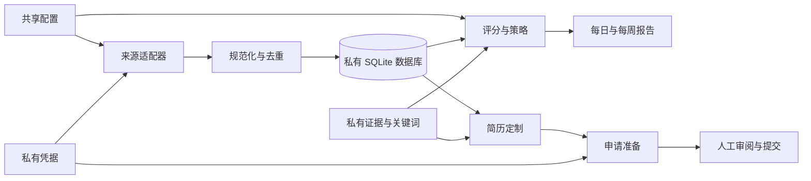

# 架构

仓库包含三个可执行软件包：

- `job_bot` 采集、规范化、存储、评分并生成职位报告。
- `cv` 将已核实的证据转换为定制建议和文档套件。
- `application_bot` 审计会话并准备受支持的申请表单。

`private_paths.py` 是候选人私有存储的唯一规范映射。代码应导入其中的常量，而不要自行拼接私有路径。`JOBBOT_PRIVATE_DIR` 可重定位整个私有根目录。

## 配置层

公开入口按顺序组合多个版本化小文件。后出现的映射会覆盖先前映射。可通过经过校验的 `patches` 修改具名列表，因此本地覆盖无需复制整个来源列表。

私有层包含候选人事实、证据、凭据、浏览器状态、数据库、报告、截图和生成文档。JSON Schema 描述受维护的文件；`jobbot-private check` 还会检查单靠 JSON Schema 无法表达的语义与跨文件约束。

## 决策边界

采集可读取公开端点或明确配置的已认证浏览器会话。评分只对数据库中已有职位排序。简历生成只能使用证据和关键词档案中的声明。申请适配器可填写明确映射的事实并上传指定文档。

CAPTCHA、MFA、登录恢复、含义不清的问题，以及法律或人口统计类答案都必须由人工处理。最终提交不属于自动化范围。

## 输出模型

候选人的持久化输出应保存在私有根目录下：

- `database/` 保存 SQLite 状态。
- `outputs/job_bot/` 保存每日、每周和来源健康报告。
- `outputs/application_bot/` 保存准备报告和截图。
- `cv/reports/`、`cv/variants/` 和 `cv/build/` 保存定制结果和渲染文档。
- `browser/state/` 和 `browser/profiles/` 保存可复用的已认证状态。

公开测试只使用合成夹具。发布审计会检查 Git 将要发布的文件，并拒绝常见密钥、个人信息标记、生成文档、机器专用绝对路径和异常大文件。
