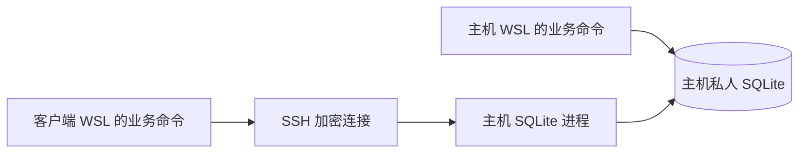

# 两台 WSL 共用私人数据库

一台主机保存 SQLite，两台 WSL 联网读写同一份数据库。主机使用本地 SQLite；
客户端经 SSH 发送 SQL 和参数，SQLite 引擎在主机上执行操作。默认情况下，私人库位于 clone 内的 `private_data/database/`；设置 `JOBBOT_PRIVATE_DIR` 后，路径会随私有根目录迁移。无需提交 GitHub。



## 更新可见性

任一台 `commit()` 成功后，另一台新查询能读取修改。已开始的读事务遵循 SQLite
快照规则，结束事务后再查询即可刷新。`watch` 默认每秒检查提交变化，只输出
更新时间。已经生成的 Markdown、JSON、PDF 报告需要重新生成。

两台都能发起写入，由主机 SQLite 协调写锁。每个连接对应独立 SSH 会话，
保留提交、回滚、主键和约束语义。断网后直接报错，不写客户端旧库、不自动
重试写入；提交期间断线时，先查询存储结果再决定是否重试。
主机 WSL 必须运行且联网，Windows 休眠期间客户端不可用。此方案不提供离线
写入和自动合并。

## 接口与范围

`job_bot/shared_database.py` 使用 Python 标准库和系统 SSH。扫描、日报、周报、
评分、策略、申请队列、CV 职位读取及隔离扫描备份已接入。未配置时保留原有
本地 SQLite 行为，不改写全局 `sqlite3.connect`。

| 项目 | 行为 |
| --- | --- |
| 主数据库 | `private_paths.JOB_DATABASE` |
| 客户端配置 | `private_paths.DATABASE_CONNECTION_CONFIG`：私有根目录下 `config/database_connection.json` |
| 私人备份 | `private_paths.DATABASE_BACKUP_DIR`：`database/backups/` |
| 数据库映射 | 私有 `database/` 目录中的同名库映射到主机；远程库不存在时失败，不创建 |
| 身份认证 | 已有 SSH 密钥或 agent；批处理连接不询问密码，不绕过主机密钥校验 |
| 网络入口 | 已有 SSH 服务，无新增数据库监听端口 |

直接用 SQLite 工具打开客户端旧文件，仍是在访问旧文件。业务命令应使用项目
数据库入口，数据库路径应位于规范的私人 `database/` 目录。外部临时测试库
保持本地行为。设置 `JOBBOT_PRIVATE_DIR` 时，两台分别使用自己的私人目录。

## 主机准备

两台需要包含本次代码变更，可通过正常 Git 流程或补丁传递代码。安装时保留
现有私人目录，不传输数据库、凭据或浏览器文件。

在主机项目根目录运行：

```bash
python3 -m job_bot.shared_database prepare-host
python3 -m job_bot.shared_database prepare-host --apply
python3 -m job_bot.shared_database check
```

准备命令先通过 SQLite Backup API 创建一致备份并检查完整性，再启用 WAL，
不修改业务记录。主机若已有连接配置，必须为 `local` 模式；没有配置时默认
使用本地库。先通过已有方式验证客户端能 SSH 登录主机并运行项目 Python。
客户端无需开放 SSH 服务。

可以使用已工作的 Tailscale 连接。官方指南提醒，同时在 Windows 和 WSL 运行
Tailscale 可能影响连接，应根据现有连接方式配置。
见 [Tailscale WSL 指南](https://tailscale.com/docs/install/windows/wsl2)。

## 客户端配置

在另一台 WSL 项目根目录运行，替换示例主机别名和主机项目路径：

```bash
python3 -m job_bot.shared_database configure \
  --host example-db \
  --project-dir '~/workspace/job-project'

python3 -m job_bot.shared_database configure \
  --host example-db \
  --project-dir '~/workspace/job-project' \
  --apply

python3 -m job_bot.shared_database check
```

第一条预览，第二条保存权限为 `600` 的私人配置。`--python` 默认
`.venv/bin/python`，可指定主机解释器。主机设置了 `JOBBOT_PRIVATE_DIR` 时，
用 `--private-dir` 指定主机私人根目录；客户端自身的环境变量仍管理其本地
资料和输出。真实机器信息只保存在私人配置或私人安装脚本中。

通过补丁安装时，先执行 `git apply --check`，再应用补丁。发生冲突时先解决，
不覆盖或重置现有工作。命令可以直接用 `python3 -m job_bot.shared_database`；
重新 editable install 后，也可以用 `jobbot-db`。

检查成功后，原有业务命令使用主机库，客户端旧库保留。客户端若已有独有记录，
先备份并按业务主键和关联关系迁移；本方案不会自动合并两份旧库。

```bash
python3 -m job_bot.shared_database watch
```

## 验收与运行边界

1. 两台分别运行 `check`。
2. 一台启动 `watch`，另一台执行一次原本计划进行的数据库更新。
3. 提交后约一个轮询周期内应报告变化；重新查询或生成报告应看到更新。
4. 主机断网或关闭时，客户端命令失败，客户端旧库保持原样。

测试使用合成数据库和两个独立客户端进程，验证双向可见性、事务回滚、断线
释放写锁、约束错误、原生 `sqlite3.Row`、分页读取及 WAL 一致备份，不需要
真实账号或网络，也不向真实库插入测试记录。

凭据、证据资料、简历和浏览器配置仍分别在各机器维护。数据库中的绝对文件
路径和 `browser_tabs.target_id` 属于产生它们的机器。另一台执行浏览器流程
前需做本机 session/login preflight 并检查文档路径；同一申请的浏览器流程
由一台负责。共享数据库不会迁移浏览器登录状态。

两台代码和 schema 应保持兼容。SSH 会话闲置 15 分钟后关闭并回滚未提交事务。
单次协议消息上限 16 MiB，查询结果分批读取。大量逐行 SQL 有网络延迟，
需要时使用已有的 `executemany` 接口。

## 备份与恢复

共享访问之外仍需保留私人备份。活动 SQLite 通过 Backup API 生成快照，
不直接复制活动库、WAL 或 journal 文件。隔离扫描的 `source.backup(...)`
在 SSH 后端也使用一致快照，并在传输后删除中间文件。主机重启后无需另行
启动数据库服务，SSH 连接按需创建进程。

切换主机时先停止写入、取得一致备份、验证新主机，再修改客户端配置。
`local --apply` 只切换连接模式，不刷新旧数据，仅在原主机或经恢复验证的新
主机上使用。

SQLite 官方建议将数据库引擎与文件放在同一机器，由代理接收远程请求。
本方案采用这一方式。参见 [SQLite 网络使用建议](https://www.sqlite.org/useovernet.html)
和 [SQLite Backup API](https://www.sqlite.org/backup.html)。
